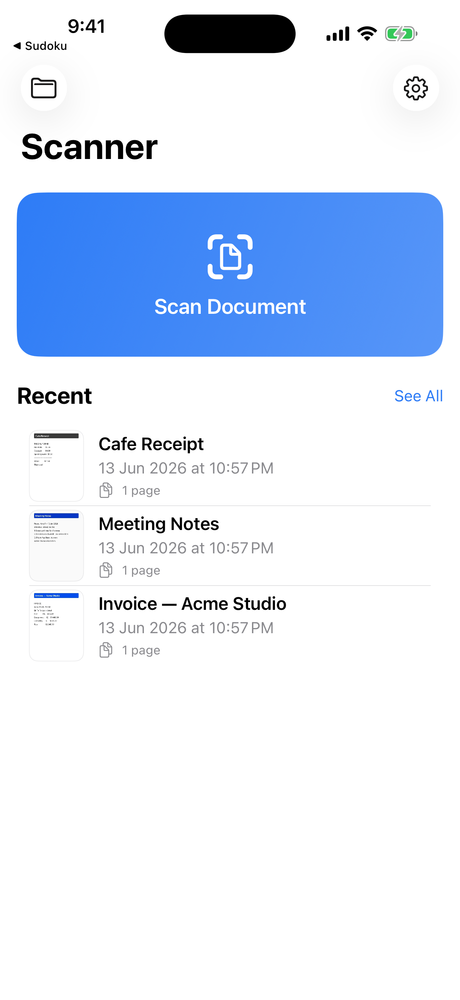
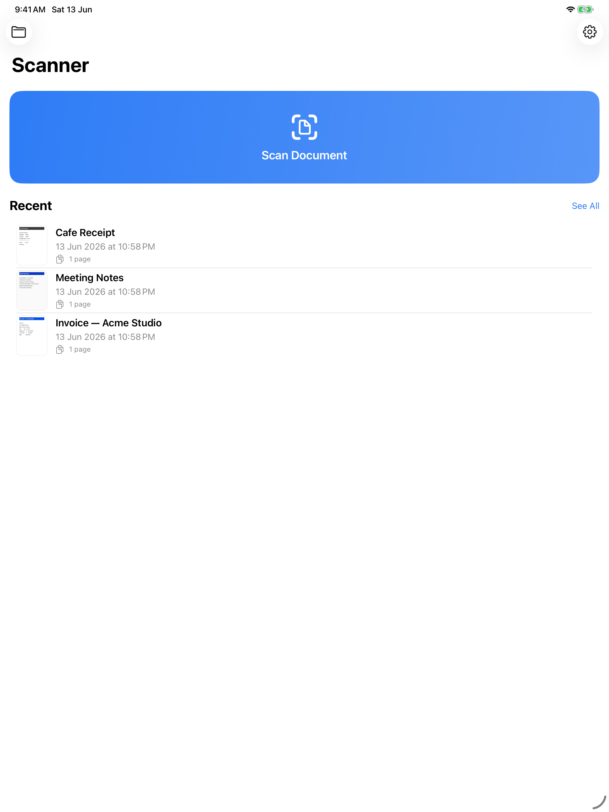

<div align="center">

# 📄 Tertiary Scanner

[](https://www.apple.com/ios/)
[](https://swift.org)
[](https://developer.apple.com/xcode/swiftui/)
[](https://developer.apple.com/documentation/visionkit)
[](#)
[](https://apps.apple.com/us/app/tertiary-scanner/id6779988762)
[](#license)

**A clean, fast, fully-offline native iOS document scanner — scan, enhance, OCR, and export to PDF or JPG in a few taps. Nothing ever leaves your device.**

### 📲 [Download on the App Store](https://apps.apple.com/us/app/tertiary-scanner/id6779988762)

[](https://apps.apple.com/us/app/tertiary-scanner/id6779988762)

</div>

## Screenshots

| iPhone | iPad |
|:------:|:----:|
|  |  |

## About

Tertiary Scanner is a native iOS document scanner built with **Swift 6**, **SwiftUI**, and an
**MVVM** architecture. It uses Apple's VisionKit document camera for edge detection and
perspective correction, Core Image for enhancement filters, and the Vision framework for
on-device OCR. Documents are stored locally with SwiftData — no account, no cloud, no tracking.

### Key Features

| | Feature |
|---|---|
| 📸 | **Scanning** — VisionKit auto edge detection, perspective correction, auto-crop, multi-page, manual corner adjust, retake, flash |
| 🎨 | **8 enhancement filters** — Original, Auto, White Document, Black & White, Denoise, Brighten, Sharpen Text, Receipt (live preview) |
| 🔤 | **OCR** — Vision text recognition; copy, export, and **search your library by content** |
| 📄 | **Export** — single/multi-page PDF (A4 / Letter / fit, adjustable quality) and high-quality JPG |
| 📤 | **Destinations** — Photos, Files, iCloud Drive, native iOS Share Sheet (AirDrop, Mail, Messages, Print, …) |
| 🗂️ | **Library** — SwiftData-backed: thumbnails, rename, delete, duplicate, share, export, search |
| ♿ | **Accessibility** — Dynamic Type, VoiceOver, Dark/Light, semantic colors |

## Tech Stack

| Category | Technologies |
|---|---|
| **Language / UI** | Swift 6, SwiftUI, MVVM |
| **Scanning** | VisionKit (`VNDocumentCameraViewController`) |
| **OCR** | Vision (`VNRecognizeTextRequest`) |
| **Image Processing** | Core Image (`CIFilter`) |
| **PDF** | PDFKit / `UIGraphicsPDFRenderer` |
| **Persistence** | SwiftData (metadata) + on-disk files (images/PDFs) |
| **Project Gen** | XcodeGen (`project.yml`) |
| **Min OS** | iOS 18+ · universal (iPhone + iPad) |

## Architecture

```
┌──────────────────────────── SwiftUI Views ────────────────────────────┐
│  Home · Scanner · Preview · Filter · Export · Library · Detail · Settings │
└───────────────┬───────────────────────────────────────┬────────────────┘
                │ @MainActor @Observable                 │
        ┌───────▼────────┐                       ┌────────▼────────┐
        │ ScannerViewModel│                       │ LibraryViewModel │
        └───────┬────────┘                       └────────┬────────┘
                │                                          │
   ┌────────────▼───────── Services (async) ───────────────▼───────────┐
   │ ScannerService · OCRService · PDFService · ExportService · Storage │
   └────────────┬──────────────────────────────────────────┬──────────┘
       Core Image│ Vision │ PDFKit │ Photos/Files           │ SwiftData
   ┌────────────▼──────────────────────┐      ┌─────────────▼──────────┐
   │ ImageProcessor (shared CIContext) │      │ ScanDocument / ScanPage │
   └───────────────────────────────────┘      │  + files on disk        │
                                               └─────────────────────────┘
```

## Project Structure

```
scannerapp/
├── project.yml                 # XcodeGen spec (signing, Info.plist, entitlements)
├── DocumentScannerApp/
│   ├── App/                    # @main App + SwiftData ModelContainer
│   ├── Models/                 # ScanDocument, ScanPage (@Model), FilterType
│   ├── Services/               # Scanner, OCR, PDF, Export, Storage
│   ├── ViewModels/             # ScannerViewModel, LibraryViewModel
│   ├── Views/                  # SwiftUI screens + Components/
│   ├── Utilities/              # ImageProcessor, SettingsStore, Constants
│   └── Resources/              # Assets.xcassets, PrivacyInfo.xcprivacy
├── screenshots/                # App Store / README screenshots
└── .claude/skills/             # app-store-submission, mobile-ios-design, ipados-design-guidelines
```

## Getting Started

### Prerequisites
- **Xcode 26+** and **[XcodeGen](https://github.com/yonaskolb/XcodeGen)** (`brew install xcodegen`)

### Build & Run
```bash
git clone https://github.com/alfredang/scannerapp.git
cd scannerapp
xcodegen generate
open DocumentScannerApp.xcodeproj
```
Or from the CLI (Simulator):
```bash
xcodebuild -project DocumentScannerApp.xcodeproj -scheme DocumentScannerApp \
  -destination 'platform=iOS Simulator,name=iPhone 17' build CODE_SIGNING_ALLOWED=NO
```

> The Simulator has no camera, so the **Scan** button falls back to the photo picker.
> Launch with `SCANNER_SEED_DEMO=1` to populate sample documents for testing/screenshots.

To run on a device, open the target → **Signing & Capabilities** → select your Team.

## App Store

**Tertiary Scanner** is live on the App Store — **[download it here](https://apps.apple.com/us/app/tertiary-scanner/id6779988762)** (`com.tertiaryinfotech.scannerapp`).

[](https://apps.apple.com/us/app/tertiary-scanner/id6779988762)

The end-to-end submission workflow (API-first, with the few web-UI-only steps documented) lives in
[`.claude/skills/app-store-submission/`](.claude/skills/app-store-submission/).

## Contributing

1. Fork the repo
2. Create a feature branch (`git checkout -b feature/amazing`)
3. Commit your changes
4. Open a Pull Request

## License

Released under the MIT License.

---

<div align="center">

**Developed by Tertiary Infotech Academy Pte. Ltd.**

⭐ Star this repo if you find it useful!

*Powered by Tertiary Infotech Academy Pte Ltd*

</div>
